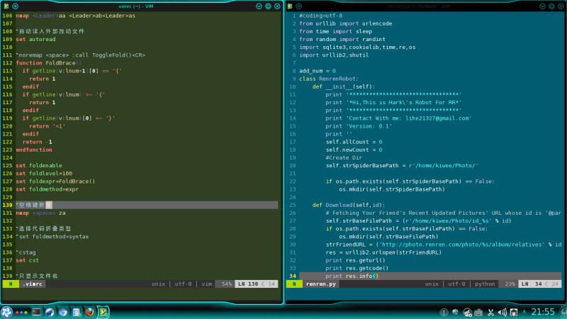

&emsp;&emsp;在Linux系统中,内核为每一个新创建的文件分配一个索引结点。文件属性保存在索引结点里，在访问文件时，索引结点被复制到内存在，从而实现文件的快速访问。

&emsp;&emsp;链接是一种在共享文件和访问它的用户的若干目录项之间建立联系的一种方法。Linux中包括两种链接：硬链接(Hard Link)和软链接(Soft Link),软链接又称为符号链接（Symbolic link）。

&emsp;&emsp;上面是官方解释，我的理解就是Linux下所有的文件名就是个指针，那硬链接跟软链接都是怎么操作这个指针的呢？

&emsp;&emsp;硬链接是面向结点的，就相当于复制了这个指针，两个指针指向同一个地址，这个有点像备份，不过比备份更牛逼的是他还能及时更新，比如我就是把我的vimrc（vim的配置文件）建立了一个硬链接指向ubuntuone的备份文件夹里，这样，我每次修改我的vimrc，我的私有云里面也是最新的。

&emsp;&emsp;软链接是面向路径的，就相当于创建了一个指向指针的指针，因此当被指对象删除时就失效了。这个就相当于windows里面的快捷方式。

&emsp;&emsp;硬链接命令形式  ln 源文件 目标文件
&emsp;&emsp;软链接命令形式  ln -s 源文件 目标文件

&emsp;&emsp;注意，需要以root权限操作的自己加sudo或者su或者其他。最后顺便得瑟一下我的vim配色。

&emsp;
