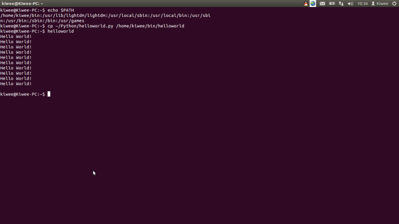

&emsp;&emsp;PATH 决定了shell将到哪些目录中寻找命令或程序。比如，我在终端中键入了gcc，shell就会先去PATH的目录中查找gcc的程序，如果有的话就调用运行，没有就会提示没有这个选项。echo $PATH这个命令可以查看PATH环境变量中的各个目录，由此我们可以想到，只要我们把自己写的程序复制到其中一个目录下面，我们就可以通过命令直接调用我们的程序。可以举个例子，我在我的主文件夹（即/home/kiwee，kiwee是我的用户名）新建一个bin文件夹，我们将其加入PATH变量中去——这可以通过运行PATH=$PATH:/home/kiwee/bin完成，其中“/home/kiwee/bin”是我想要添加到PATH变量中的目录。再次输入echo $PATH就可以发现/home/kiwee/bin已经添加到其中了。

&emsp;&emsp;OK，下面我们写个例子测试一下。我在我的主文件夹的Python的目录下面新建了一个新的Python脚本，命名为hellowold.py。下面为其中代码，
&emsp;&emsp;
&emsp;&emsp;当然，你也可以自己写shell脚本什么的，或者是个你自己写的编译完的小程序，都可以。下面运行cp ～/Python/helloworld.py  /home/kiwee/bin/helloworld将脚本拷贝到我们刚才建立的bin文件夹下。接下来我们在终端直接输入helloworld，就可以看到终端上打印出了10个helloworld。OK，PATH就这么简单。。。完整操作可以见下图。

&emsp;
